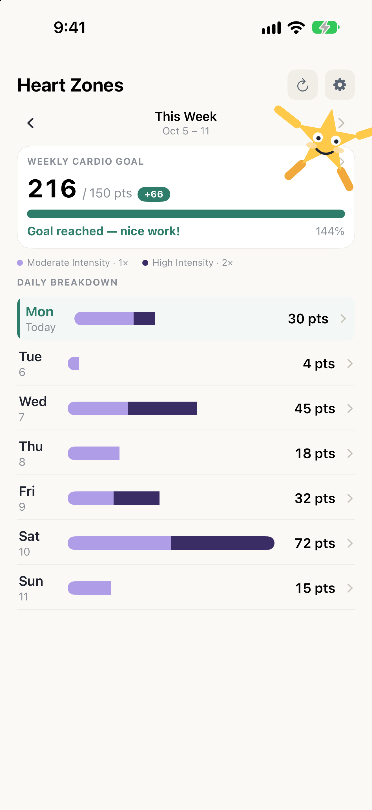

# Heart Zones

An iPhone app that turns the heart rate data your Apple Watch already records into a simple weekly cardio score.

Every minute spent in a heart rate zone earns points toward a weekly goal (150 by default):

| Zone | Intensity | Points per minute |
| --- | --- | --- |
| 1 | Very light | 0 |
| 2–3 | Light – moderate | 1 |
| 4–5 | Hard – maximum | 2 |

Zones are based on your max heart rate (220 − age, from Apple Health), or you can set your own. The home screen shows progress for the week with a day-by-day breakdown, and each day drills down into time per zone and an hour-by-hour chart of when points were earned.

Heart Zones only reads from Apple Health. All data stays on your device — no accounts, servers or analytics. See the [privacy policy](https://dawhalen.github.io/ez-heart-zones/privacy.html).
